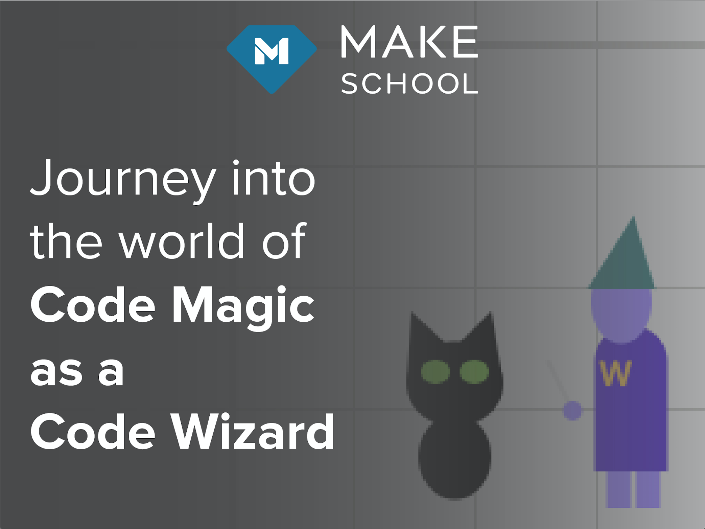
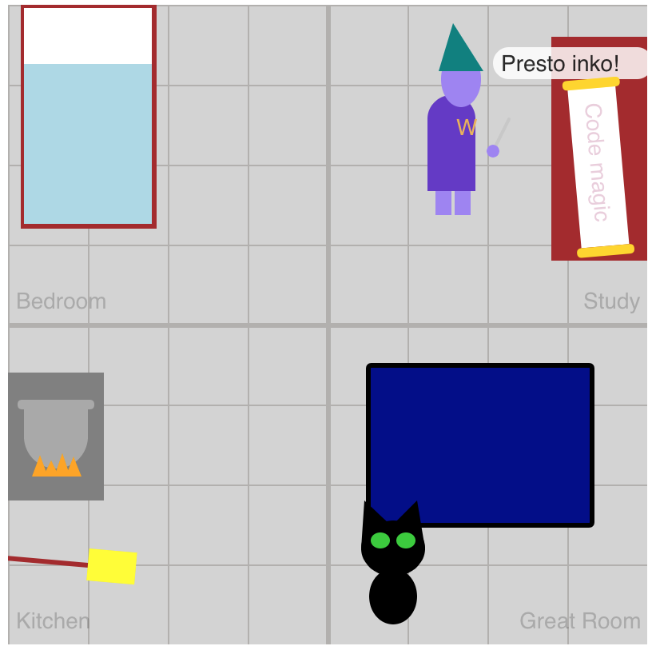

This tutorial is a beginner-friendly introduction to the basics of programming.

You'll start out by copying code, then learning to modify parts of the code, and finally you will start writing your own code from scratch.

At the end of the tutorial are additional challenges, for beginners and advanced learners, to push your programming understanding even further.

## Navigating the Tutorial

### Learning

Along the way, important information will be highlighted in an...

> [info]
> information box

### Doing

Any time you need to add some code or complete and important step, you'll find it in an...

> [action]
> action box

### Checking

After you've come up with your own answer, you can expand the...

> [solution]
> solution box

### Growing

Along the way and at the end of the tutorial, you can push yourself by tackling all of the...

> [challenge]
> challenges in boxes like this

## What You'll Learn

> [info]
>In this tutorial you will build up your comfort working with the basic building blocks of programming:
>
> - variables
> - objects
> - functions
> - conditional logic
> - if statements
> - loops

Starting from an empty canvas, you will soon be creating and customizing your own wizard and castle, and giving your wizard magical powers to interact with the world around you.



# Accessing the Starter Project

Where will you actually write the code? There are two options for getting the starter project.

## Best Option - Use repl.it

Repl.it is a website makes it easy to jump right in to programming without having to set up a local environment. Whether you are a beginning or advanced programmer, it's a great way to jump right into the code.

> [action]
> In a new window, go to [CodeWizardCastleTutorial on Repl.it](https://repl.it/@MakeSchoolRAMP/CodeWizardCastleTutorial)

<!-- ### Repl.it Interface Overview -->

<!-- TODO: Screenshot and overview of navigating repl.it project -->

## Alternate Option - Use GitHub

This tutorial does not cover working with GitHub or getting set up for local development of web projects, but if those are things you are already comfortable with, you can clone the starter project from GitHub.

> [action]
> In a new window, go to [Code-Wizard-Castle-Starter on GitHub](https://github.com/MakeSchool-Tutorials/Code-Wizard-Castle-Starter)

# Project Introduction

When viewing the starter project, you should see the following files:

```
index.html
sketch.js
wizardClass.js
spellFunctions.js
drawFunctions.js
helperFunctions.js
```

## index.html

The `index.html` page loads the content that you see in the browser when you run the program. Between the `<body>` and `</body>` tags is where things like page headers and paragraph text are found.

> [challenge]
> In `index.html`, find `<h1>Code Wizard Castle</h1>` and change it to `<h1>YOUR_NAME's Code Wizard Castle</h1>`

Also in `index.html` are some `script` tags that load all of the `.js` (JavaScript) files needed for this project.

```HTML
<script src="https://cdnjs.cloudflare.com/ajax/libs/p5.js/0.6.1/p5.js"></script>
<script src="wizardClass.js"></script>
<script src="helperFunctions.js"></script>
<script src="spellFunctions.js"></script>
<script src="drawFunctions.js"></script>
<script src="sketch.js"></script>
```

The first one, that ends in `libs/p5.js/0.6.1/p5.js` loads in helper functions from the [p5.js Library](p5js.org), which provides helper functions make it easier to display the visual elements of the project.

The rest of the loaded files are the files that belong to this project.

The main reason for having multiple files is to keep the code organized.

> [info]
> The `sketch.js` file is loaded last in `index.html` because it uses code from the other files to control the overall program.

## sketch.js

The majority of this tutorial will be making changes in `sketch.js`, with a few updates inside some of the other `.js` files as well towards the later part of the tutorial.

When viewing `sketch.js` you should see this starter code:

```
function setup() {
  createCanvas(400, 400);
}

function draw() {
  background("lightgray");
}
```

When you first run the program you should see that right now it just has a light gray square on the page.

<!-- TODO: image of starter page -->

The `setup()` function only runs one time at the start of the program. Code should be added here if it only needs to run once, usually to assign initial values to things.

The line `createCanvas(400,400)` creates the canvas with a width and height of 400.

> [challenge]
> Try adjusting the values passed to `createCanvas(width,height)` to see how the shape of the canvas changes
>
> Don't forget to reset it back to `createCanvas(400,400)` before you continue!

The `draw()` function is a loop that runs forever for as long as you are running the program. This is the place for code that needs to update values or perform actions that should always happen.

The line `background("lightgray")` fills the entire canvas with the color given.

> [challenge]
> Try changing the color name in `background("colorName")` to see if you can fill the canvas with different colors.
>
> Reset back to `background("lightgray")` before you continue (unless you want a castle floor that's a unique color).

These four helper functions are provided by the [p5.js Library](p5js.org), which has been designed to make creating art and designs with code more accessible.
