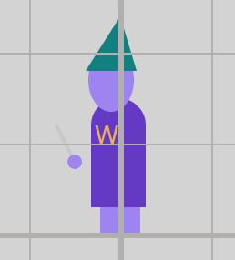
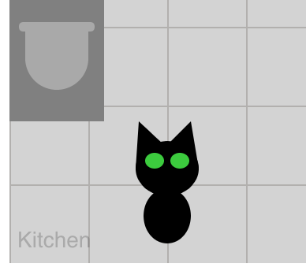
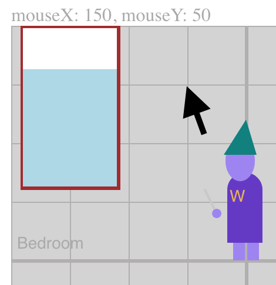
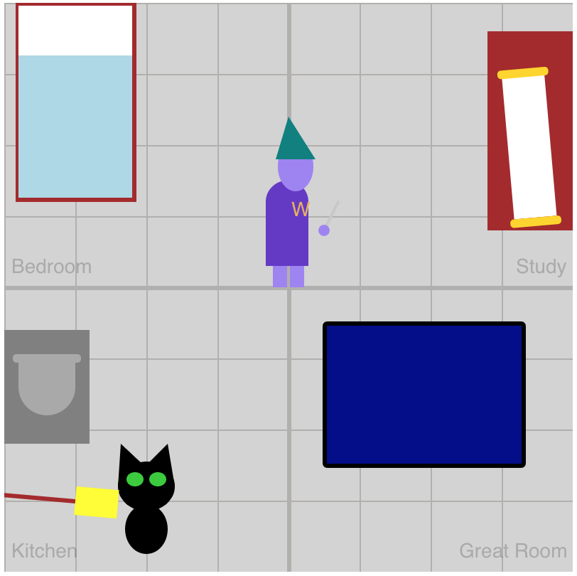

There is no castle to decorate quite yet. Let's add one.

> [action]
> Inside of `draw()`, add `drawCastle();` on a new line
>

Did you put it before or after `drawWizard()`? Try switching the order to see what happens.

## Check

> [solution]
> Order matters! If you call `drawCastle()` last, your `wizard` looks like he is stuck in the floor, because the floor tile lines were drawn *after* the `wizard`.
>
>```js
> function draw() {
>   background("lightgray");
>
>   drawWizard();
>   drawCastle(); // <---
> }
>```
>
> When you draw the castle **after** the wizard...
>
>
>

<!--  -->

> [action]
> Put the two functions in the correct order so that the `wizard` is on top.

Now your wizard has a 4-room castle, nice!

There are still 3 global variables for other objects to add to the castle: `pet`, `magicScroll`, and `broom`.

# Summon Your Familiar

A wizard would be lonely without their familiar, their magical pet friend. Let's summon one and use some new code magic along the way!

So far, you've seen how to update values on an object using the `objectName.propertyName = value` format. Here's another way of creating and assigning values to an object all at once.

> [action]
> Inside of the `setup()` function, after everything else, add:
>
> ```js
> pet = {
>   x: 100,
>   y: 350,
>   type: "cat",
>   color: color("black"),
> }
> ```

<!--  -->

> [action]
> Inside of `draw()`, add `drawPet();` (remember that order matters!)

You should see a black cat in the lower left corner of the castle:



## Check

> [solution]
>
> ```js
> function setup() {
>   createCanvas(400, 400);
>
>   wizard = new Wizard();
>   // ... code skipped for brevity
>
>   // <--- start
>   pet = {
>     x: 100,
>     y: 350,
>     type: "cat",
>     color: color("black"),
>     walkSpeed: 0.5,
>   }
>   // <--- end
> }
>
> function draw() {
>   background("lightgray");
>
>   drawCastle();
>   drawWizard();
>   drawPet(); // <---
> }
> ```
>

Feel free to play with the values to change things and explore. You can change the pet's location by adjusting the `x` and `y` values inside of `pet = { ... }`.

> [action]
> For help getting exact coordinates, you can add the following helper code to the end of the `draw()` function: `reveal(mouseLocation(), "mouseInfo");`

<!--  -->

> [info]
> Have you noticed that bigger `y` values are lower on the canvas? That's because position `0, 0` is in the **upper left** corner, not the bottom left.

Now you should see the coordinates that your mouse is at on the top left corner above the canvas.

## Check

> [solution]
>
> ```js
> function draw() {
>   background("lightgray");
>
>   drawWizard();
>   drawCastle();
>   drawPet();
>
>   reveal(mouseLocation(), "mouseInfo"); // <---
> }
> ```
>
> 
>

<!--  -->

> [challenge]
> If you don't want a `"cat"`, you can also try a `"frog"`, or `"ghost"` for your pet's `type`.

# More Magical Objects

Let's add object properties for the last two global variables, `magicScroll` and `broom`, so your wizard can have a full collection of magical objects.

Just like you did for adding the pet, you'll add some properties to each object in `setup()` and then call the function that draws it inside of `draw()`.

> [action]
> Inside of `setup()`, after `pet = { ... }`, add:
>
> ```js
> magicScroll = {
>   x: 300,
>   y: 50,
> }
>
> broom = {
>   x: 350,
>   y: 350,
> }
> ```
>

<!--  -->

> [action]
> Inside of `draw()`, add `drawScroll();` and `drawBroom();`

<!--  -->

> [action]
> Adjust the values so that the `magicScroll` is on the desk in the study, and the `broom` is by the fireplace in the kitchen.



## Check

> [solution]
>
> ```js
> var wizard, pet, magicScroll, broom;
>
> function setup() {
>   createCanvas(400, 400);
>
>   wizard = new Wizard();
>   wizard.wandColor = color(200);
>   wizard.hatColor = color("teal");
>   wizard.robeColor = color(100, 50, 200);
>   wizard.skinColor = color("#9e81f4");
>   wizard.magicalName = "Wizard";
>   wizard.magicalNameColor = color("#e8b255");
>
>   pet = {
>     x: 100,
>     y: 350,
>     type: "cat",
>     color: color("black"),
>     walkSpeed: 0.5,
>   }
>
>   // <--- start
>   magicScroll = {
>     x: 380,
>     y: 50,
>   }
>
>   broom = {
>     x: 50,
>     y: 350,
>   }
>   // <--- end
> }
>
> function draw() {
>   background("lightgray");
>
>   drawCastle();
>   drawWizard();
>   drawPet();
>   drawScroll(); // <---
>   drawBroom(); // <---
>
>   reveal(mouseLocation(), "mouseInfo");
> }
> ```
>
