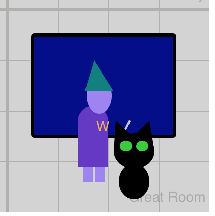
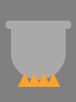
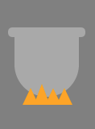
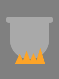

Right now your castle is pretty static, with no movement other than your wizard looking around. Let's bring things to life!

First let's give your `wizard` the ability to walk around, by adding another property `walkSpeed` and then calling a helper function that will update the position for you.

> [action]
> Inside of `setup()`, at the end of the other wizard properties, add `wizard.walkSpeed = 0.5;`

<!--  -->

> [action]
> Inside of `draw()`,  add `wizard.updatePosition();`

Now you should see your `wizard` automatically walking towards wherever your mouse is.

> [solution]
>
> ```js
> function setup() {
>   createCanvas(400, 400);
>
>   wizard = new Wizard();
>   // ... code skipped for brevity
>   wizard.walkSpeed = 0.5; // <---
>
>   // ... code skipped for brevity
> }
>
> function draw() {
>   background("lightgray");
>
>   wizard.updatePosition(); // <---
>   // ... code skipped for brevity
>
>   reveal(mouseLocation(), "mouseInfo");
> }
> ```
>

# Functional Motion

But let's give you a little more control - instead of the `wizard` walking all of the time, let's change it to only update position when you have pressed the `SHIFT` key on the keyboard.

To accomplish this, you'll add your first custom function and then call it!

> [action]
> At the end of `sketch.js`, **after** the end of the `draw()` function, add a new custom function called `updateWizardPosition()`:
>
> ```js
> function updateWizardPosition() {
>   if (keyIsDown(SHIFT)) {
>     wizard.updatePosition();
>   } else {
>     // do not move the wizard
>   }
> }
> ```
>

This function contains an `if else` statement that checks if the `SHIFT` key is currently being pressed using the helper function `keyIsDown()`. If the result is yes, or `true`, then it will call `wizard.updatePosition();`, if not, it will do nothing.

> [info]
> Including an `else` statement that doesn't do anything isn't required, but it is a good way to keep things easy to read and to add a note about the effect of doing nothing.

Now that we have this new function, let's call it:

> [action]
> Back up in `draw()`, remove `wizard.updatePosition();` and replace it with a call to your new function: `updateWizardPosition();`

Now, your `wizard` should only walk towards the mouse when you are pressing the `SHIFT` button.

> [info]
> **NOTE:** Be sure to click onto the canvas first, otherwise the key press won't be correctly captured and your wizard won't walk.

## Check

> [solution]
>
> ```js
> function draw() {
>   background("lightgray");
>
>   updateWizardPosition(); // <---
>   // ... code skipped for brevity
> }
>
> // <--- start
> function updateWizardPosition() {
>   if (keyIsDown(SHIFT)) {
>     wizard.updatePosition();
>   } else {
>     // do not move the wizard
>   }
> }
> // <--- end
> ```
>

# Frolicking Familiar

Let's get your pet moving now, too.

Just like we gave the `wizard` a `walkSpeed` we need to give one to the `pet`.

> [action]
> Add a new property to the end of the `pet` object properties:
>
> ```js
> pet = {
>   x: 100,
>   // ... code skipped for brevity
>   color: color("black"),
>   walkSpeed: 0.5, // <---
> }
> ```
>

Like before, we're also going to add a new custom function, `updatePetPosition()`, that will help control how the pet moves. For this one you'll learn how to work with an even bigger `if` statement.

> [action]
> At the end of `sketch.js`, add:
>
> ```js
> function updatePetPosition() {
>   if (pet.x > width) {
>     pet.walkSpeed = pet.walkSpeed * -1;
>   } else if (pet.x < 0) {
>     pet.walkSpeed = pet.walkSpeed * -1;
>   } else {
>     // leave walkSpeed the same
>   }
>
>   pet.x = pet.x + pet.walkSpeed;
> }
> ```
>

Take a few minutes to examine the 3-part `if else` statement.

The first `if` checks if the `pet` has walked past the right edge of the canvas (the variable `width` is automatically assigned to match the size of the canvas from `createCanvas`).

The second part, `else if`, checks if the `pet` has gone off the left side of the canvas.

In either of those cases, `pet.walkSpeed` is multiplied by `-1` in order to reverse the direction the `pet` is walking.

Lastly, the `else` statement is for any time the `pet` is not on either edge, and should not alter `walkSpeed`.

Positive speed walks to the right, negative to left, as the `pet.x` value is updated in the last line of the function.

Now we need to call our new function to get that familiar frolicking back and forth in the castle.

> [action]
> Inside of `draw()`, add `updatePetPosition();`

Your wizard's familiar should now be moving back and forth horizontally in the castle.



## Check

> [solution]
>
> ```js
> function setup() {
>   // ... code skipped for brevity
>
>   pet = {
>     // ... code skipped for brevity
>     walkSpeed: 0.5, // <---
>   }
>   
>   // ... code skipped for brevity
> }
>
> function draw() {
>   background("lightgray");
>
>   updateWizardPosition();
>   updatePetPosition(); // <---
>   // ... code skipped for brevity
> }
>
> function updateWizardPosition() {
>   // ... code skipped for brevity
> }
>
> // <--- start
> function updatePetPosition() {
>   if (pet.x > width) {
>     pet.walkSpeed = pet.walkSpeed * -1;
>   } else if (pet.x < 0) {
>     pet.walkSpeed = pet.walkSpeed * -1;
>   } else {
>     // leave walkSpeed the same
>   }
>
>   pet.x = pet.x + pet.walkSpeed;
> }
> // <--- end
> ```
>

# Turn Up the Heat

Stone castles get cold. Let's add one more touch of motion to warm up this castle - a nice roaring fire in the kitchen!

To add this effect, you'll make a tiny change to an existing function inside of the `drawFunctions.js` file.

> [action]
> Navigate to the `drawFunctions.js` file, scroll down to find the `drawKitchen()` function, and locate the `// draw fire` section (just after line 150).

Take a look at the existing code:

```js
// draw fire
var fireX = x + 15;
var fireY = y + 95;

fill("orange");

while (fireX < cauldWidth) {
  var flameHeight = 10; // TODO: update flameHeight value

  triangle(fireX, fireY, fireX + 10, fireY, fireX + 5, fireY - flameHeight);
  fireX += 7;
}
```
This code is using **local** variables, `fireX`, `fireY`, `flameHeight`, and `cauldWidth` (defined a few lines above in `drawKitchen()`).

> [info]
> Local variables are defined, assigned, and used within a single code block, between { and }.

That means that these variables are not visible or available for use outside of the `drawKitchen()` function.

The part that needs to change is `flameHeight`. This variable is used in the `triangle()` function to create the top point of the triangle. Right now it's set to `0`, which is why we don't see any triangle flames.

> [action]
> Change the value to `10` and see how the fire appears under the cauldron: `var flameHeight = 10;`



The flames are created using a `while` loop.

> [info]
> Unlike `if` statements, which run once if `true`, as long as the conditional statement of a `while` loop is `true`, the contents of the loop are repeated.

Notice that the value of `fireX` is updated each time it reaches the end of the loop. Eventually, `fireX` will increase until it is more than `cauldWidth` (currently assigned to `40`), and the condition will be `false` and the loop is ended.

> [challenge]
> Play with changing the value of `cauldWidth` - what effect does it have?

Since the code that assigns `flameHeight` is called each time the loop repeats, let's change the value each time for a more lively fire effect.

We can use the helper function `random()`.

> [action]
> Replace `var flameHeight = 10;` with `var flameHeight = random(10,20);`

Watch the flames come to life.



> [info]
> The two values passed to `random()` are the low and high numbers that you want it to randomly select from.

In this case the smallest a flame could be is `20`, and the biggest is `15`.

> [action]
> Try out other values to create a bigger or smaller fire effect.

## Check

> [solution]
>
> ```js
> // inside of drawFunctions.js
>
> function drawKitchen(x, y) {
>   drawRoomLabel("Kitchen",  x + 5, y + 190);
>   // ... code skipped for brevity
>
>   // draw fire
>   var fireX = x + 15;
>   var fireY = y + 95;
>
>   fill("orange");
>
>   while (fireX < cauldWidth) {
>     var flameHeight = random(10, 20); // <---
>
>     triangle(fireX, fireY, fireX + 10, fireY, fireX + 5, fireY - > flameHeight);
>     fireX += 7;
>   }
> }
> ```
>
