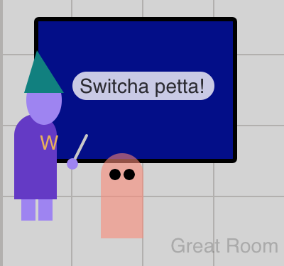

The time has come to add some interaction by giving your `wizard` some spells to cast.

We'll make it so that your `wizard` casts a spell when you click the mouse.

> [action]
> At the end of `sketch.js`, after your other custom functions, add:
>
> ```js
> function mousePressed() {
>   wizard.castSpell();
> }
> ```
>

If you peek inside of `wizardClass.js` file to look at the `castSpell()` function, you can see that it checks if `currentSpell` exists, and if it does, it will call it:

```js
// inside of wizardClass.js

castSpell() {
  if (this.currentSpell) {
    this.currentSpell();
  }
}
```

> [info]
> What is `this`?
>
>`this.propertyName` or `this.functionName()` is the way that class objects refer to their own values and call class functions.
>
> It can take some time to get used to working with `this` - for now you can think of it working just as if you were to use `wizard.propertyName` or `wizard.functionName()`.

So far, every time we've added a new function we have also had to then call the function from somewhre. But the `mousePressed()` function is special.

> [info]
> The `mousePressed()` helper function is part of the `p5.js` library, and is automatically called when you click the mouse on the canvas, so you do not need to call it from anywhere.

## Check

> [solution]
>
> ```js
> var wizard, pet, magicScroll, broom;
>
> function setup() {
>   // ... code skipped for brevity
> }
>
> function draw() {
>   // ... code skipped for brevity
> }
>
> function updateWizardPosition() {
>   // ... code skipped for brevity
> }
>
> function updatePetPosition() {
>   // ... code skipped for brevity
> }
>
> function mousePressed() {
>   wizard.castSpell();
> }
> ```
>

Even though `mousePressed()` **is** automatically called for you, if you try the program now you won't see any change because we haven't given the `wizard` a `.currentSpell` yet, so `if (this.currentSpell)` will always be `false`.

# Spell Selection

We have several different spells to use, so let's add function `updateCurrentSpell()` that will control which one to use based on which room the `wizard` is in.

By the end, `updateCurrentSpell()` will help the wizard to:

- In the bedroom, cast a spell to change outfits.
- In the kitchen, cast a transformation spell on the familiar.
- In the study, reveal the magic message on the scroll.
- In the great hall, levitate the broom.

Start by adding the beginning of the `if else` statement that will help switch between spells.

> [action]
> At the end of `sketch.js`, add:
>
> ```js
> function updateCurrentSpell() {
>   if (false) {
>     wizard.currentSpell = changeOutfitSpell;
>
>   } else {
>     wizard.currentSpell = noSpell;
>   }
> }
> ```
>

<!--  -->

> [action]
>  Inside of `draw()`, add `updateCurrentSpell();`

If you try it now, you should see your wizard saying "Hmmm..." when you click the mouse.


Because the `if` condition is currently set to `false` it will **always** use the final `else` statement and assign `.currentSpell` to `noSpell`.

If you look in `spellFunctions.js`, you'll see that `noSpell` doesn't do anything other than have the `wizard` say `Hmmmm...`, just as you saw.

```js
// at the top of spellFunctions.js

function noSpell() {
  wizard.say("Hmmm...");
}
```

This is exactly what we want, so that there's always a backup assigned in case none of the other `if` conditions are `true`, so that from now on, `wizard.currentSpell` always has a value.

If you change `false` to `true`, then it will always assign the `changeOutfitSpell`.

If you look closely, you may see that in `updateCurrentSpell` we aren't using `()` at the end of the function names - this is intentional!

> [info]
> In JavaScript, the way that you **call** or **perform** a function is by adding `()` to the end.

But in this situation, we just want to **refer** to the function by using it's name without the parentheses `()`.

> [info]
> In JavaScript, named functions are really just variables that point to function objects!
>
> ```js
> // try this at the end of the setup function
>
> var namedFunction = function () {
>   wizard.say("Mind blown!")
> }
> namedFunction();
> ```
>

If you look at the `castSpell()` function in `wizardClass.js` again, you can see that it first refers to `currentSpell` and then it calls the function with `()`:

```js
castSpell() {
  if (this.currentSpell) { // refers to it
    this.currentSpell();   // calls it
  }
}
```

Getting back to the `updateCurrentSpell()` function, we don't want to hardcode `true` or `false`, we want to use some code that will be `true` or `false` depending on which area of the castle the `wizard` is in, so that we cast a different spell in each room.

We'll do this by adding helper functions that `return` a boolean value (`true` or `false`) so that we can tell which room the wizard is in.

> [action]
> At the end of `sketch.js`, add:
>
> ```js
> function inBedroom() {
>   if (wizard.x < width/2 && wizard.y < height/2) {
>     return true;
>   } else {
>     return false;
>   }
> }
> ```
>

Now the condition of the `if` statement is a bit more complex, so let's break it down.

The first part is checking if the wizard is in the left half of the canvas, by checking if `wizard.x` is less than (`<`) half the canvas (`width/2`). If the first part is `true`, the `&&` **AND** operator continues to the condition on the right, to see if the wizard is in the top half of the canvas by checking if `wizard.y` is less than (`<`) half the canvas height (`height/2`).

When **both** of these conditions are `true`, the function returns `true`. If either one is `false`, it returns `false`.

> [info]
> Only when **both** sides of an `&&` condition are true is the whole condition true.
>
> ```js
var trueTrue = true && true; // true
var falseTrue = false && true; // false
var trueFalse = true && false; // false
> ```
>

Just one more change is needed before `updateCurrentSpell()` can start switching correctly between spells.

> [action]
> Inside of `updateCurrentSpell()`, change the first `if` condition to call the new helper function:
>
> ```js
> function updateCurrentSpell() {
>   if (inBedroom()) { // <---
>     // ... code skipped for brevity
>   }
> }
> ```
>

Try it out, and check that when `wizard` is in the bedroom area that it uses `changeOutfitSpell()` but still uses `noSpell()` everywhere else.


Right now only `wizard.wandColor` is changing.

 

> [action]
> Go into `spellFunctions.js`, in the `changeOutfitSpell()` function, and use the helper `randomColor()` to assign new colors to each of the other wizard colors:
>
> - wizard.hatColor
> - wizard.robeColor
> - wizard.skinColor
> - wizard.magicalNameColor

Awesome, right?!


## Check

> [solution]
>
> ```js
> // in sketch.js
> var wizard, pet, magicScroll, broom;
>
> // ... code skipped for brevity
>
> function draw() {
>   background("lightgray");
>
>   updateWizardPosition();
>   updatePetPosition();
>   updateCurrentSpell();
>
>   // ... code skipped for brevity
> }
>
> // ... code skipped for brevity
>
> function mousePressed() {
>   wizard.castSpell();
> }
>
> // <--- start
> function updateCurrentSpell() {
>   if (inBedroom()) {
>     wizard.currentSpell = changeOutfitSpell;
>
>   } else {
>     wizard.currentSpell = noSpell;
>   }
> }
>
> function inBedroom() {
>   if (wizard.x < width/2 && wizard.y < height/2) {
>     return true;
>   } else {
>     return false;
>   }
> }
> // <--- end
> ```
>
> ```js
> // in spellFunctions.js
>
> function changeOutfitSpell() {
>   wizard.say("Changicus!");
>
>   wizard.wandColor = randomColor();
>   wizard.hatColor = randomColor(); // <---
>   wizard.robeColor = randomColor(); // <---
>   wizard.skinColor = randomColor(); // <---
>   wizard.magicalNameColor = randomColor(); // <---
> }
> ```
>

# Wizard Whereabouts

Next up, you'll need to create the 3 remaining spells - `readScrollSpell()`, `levitateBroomSpell()`, and `transformPetSpell()` - and the helper functions - `inStudy()`, `inKitchen()`, and `inGreatRoom()` - that we'll need to assign a different spell in each room.

Let's make each new spell and the helper for the room to cast it in at the same time.

In the study your `wizard` will cast a `readScrollSpell` to read the hidden message on `magicScroll`.

> [action]
> At the bottom of the `spellFunctions.js` file, add:
>
> ```js
> function readScrollSpell() {
>   wizard.say("Presto inko!");
>   magicScroll.inkVisibility = 255;
> }
> ```
>

<!--  -->

> [challenge]
> Read the contents of `drawScroll()` in `drawFunctions.js` to try and guess what effect assigning `magicScroll.inkVisibility = 255` will have.
>
> A short explanation is given further below.

Now we need the `inStudy()` helper and then to use it inside of `updateCurrentSpell()`.

> [action]
> At the bottom of `sketch.js`, create a new `inStudy()` helper function.
>
> Using `inBedroom()` as your example, modify the the `if` conditions to correctly compare the `wizard` `x` and `y` values with the correct location of the study.

 In addition to using `<` (less than), you may also need to use `>` (greater than). Be sure to combine **two** conditions using `&&` to ensure the `wizard` is in the correct corner of the castle.

> [action]
>  Next, add a new `else if` condition in the middle of `updateCurrentSpell()` that uses your newly made `inStudy()` function.
>
> ```js
> if (inBedroom()) {
>   wizard.currentSpell = changeOutfitSpell;
>
> } else if (inStudy()) {
>   wizard.say("Study time!");
>
> } else {
>   wizard.currentSpell = noSpell;
> }
> ```
>

When you cast your new spell in the Study, you should see a magical message appear and then disappear on the scroll.


The `inkVisibility` property on `magicScroll` is used to assign a transparency value when displaying the scroll's message. `readScrollSpell` sets `magicScroll.inkVisibility` to the maximum value of `255` (same as the 0 to 255 range for colors), which makes it fully visible. But over time, the value of `inkVisibility` decreases back to `0` using `disappearSpeed`, making it fully transparent and no longer visible:

You may have noticed that the `readScrollSpell()` function uses 3 other properties of `magicScroll` that you can adjust: `message`, `color`, and `disappearSpeed`.

> [action]
> In `setup()`, add and customize the extra properties in the existing `magicScroll` object:
>
> ```js
> magicScroll = {
>   x: 380,
>   y: 50,
>   message: "Hello World", // <---
>   color: color("orange"), // <---
>   disappearSpeed: 1, // <---
> }
> ```
>

In the kitchen, your `wizard` will call `levitateBroomSpell()`. Why sweep when you can use magic, right?

> [action]
> At the bottom of file `spellFunctions.js`, add:
>
> ```js
> function levitateBroomSpell() {
>   wizard.say("Levi broomi!");
>   broom.levitate = !broom.levitate;
> }
> ```
>

This spell uses the `!` (bang) to toggle the boolean `true` / `false` value of `broom.levitate`.

> [info]
> Adding `!` in front of a boolean value will return the opposite value.
>
> ```js
var bangTrue = !true; // false
var bangFalse = !false; // true
> ```
>

So if `broom.levitate` is currently `true`, it will be assigned to `false`, and vice versa.

> [action]
> Create the `inKitchen()` helper function at the bottom of `sketch.js`

<!--  -->

> [action]
> Add a new `else if` inside of `updateCurrentSpell()` and assign `wizard.currentSpell` to `levitateBroomSpell` when `inKitchen()` is `true`

Now your `wizard` has the power to levitate and move the `broom` with the mouse.

 

> [challenge]
> Check out the `drawBroom()` function in `drawFunctions.js` to better understand the effects of changing the value of `broom.levitate`.

Lastly, in the Great Room, your `wizard` will practice transforming your `pet` into different creature forms.

> [action]
> At the bottom of `spellFunctions.js`, add:
>
> ```js
> function transformPetSpell() {
>   wizard.say("Switcha petta!");
>
>   var petTypes = [
>     "cat",
>     "frog",
>     "ghost"
>   ]
>
>   var newType = random(petTypes);
>   var newColor = randomColor();
>
>   pet.type = newType;
>   pet.color = newColor;
> }
> ```
>

Previously you used `random` to select a number value from a range, but it can also be used to randomly select an item from a list - an `Array` object JavaScript.

> [info]
> `Array`s are created by putting values inside of square brackets: `var array = [1, 2, 3]`

`petTypes` is an array of names of the possible `pet` types.

One final step to finish adding the ability to cast the fourth spell.

> [action]
> Create the `inGreatRoom()` helper at the bottom of `sketch.js`

<!--  -->

> [action]
> Add a new `else if` inside of `updateCurrentSpell()` to use `transformPetSpell` when `inGreatRoom()` is `true`.

Have fun transforming your pet! (I'm pretty sure it doesn't hurt...)

 

## Check

> [solution]
>
> ```js
> // in sketch.js, after mousePressed()
>
> // <--- start
> function updateCurrentSpell() {
>   if (inBedroom()) {
>     wizard.currentSpell = changeOutfitSpell;
>
>   } else if (inStudy()) {
>     wizard.currentSpell = readScrollSpell;
>
>   } else if (inKitchen()) {
>     wizard.currentSpell = levitateBroomSpell;
>
>   } else if (inGreatRoom()) {
>     wizard.currentSpell = transformPetSpell;
>
>   } else {
>     wizard.currentSpell = noSpell;
>   }
> }
>
> function inBedroom() {
>   if (wizard.x < width/2 && wizard.y < height/2) {
>     return true;
>   } else {
>     return false;
>   }
> }
> function inStudy() {
>   if (wizard.x > width/2 && wizard.y < height/2) {
>     return true;
>   } else {
>     return false;
>   }
> }
>
> function inKitchen() {
>   if (wizard.x < width/2 && wizard.y > height/2) {
>     return true;
>   } else {
>     return false;
>   }
> }
>
> function inGreatRoom() {
>   if (wizard.x > width/2 && wizard.y > height/2) {
>     return true;
>   } else {
>     return false;
>   }
> }
> // <--- end
> ```
>
> ```js
> // spellFunctions.js
>
> function noSpell() {
>   wizard.say("Hmmm...");
> }
>
> function changeOutfitSpell() {
>   wizard.say("Changicus!");
>
>   wizard.wandColor = randomColor();
>   wizard.hatColor = randomColor(); // <---
>   wizard.robeColor = randomColor(); // <---
>   wizard.skinColor = randomColor(); // <---
>   wizard.magicalNameColor = randomColor(); // <---
> }
>
> // <--- start
> function readScrollSpell() {
>   wizard.say("Presto inko!");
>   magicScroll.inkVisibility = 255;
> }
>
> function levitateBroomSpell() {
>   wizard.say("Levi broomi!");
>   broom.levitate = !broom.levitate;
> }
>
> function transformPetSpell() {
>   wizard.say("Switcha petta!");
>
>   var petTypes = [
>     "cat",
>     "frog",
>     "ghost",
>   ]
>
>   var newType = random(petTypes);
>   var newColor = randomColor();
>
>   pet.type = newType;
>   pet.color = newColor;
> }
> // <--- end
> ```
>
