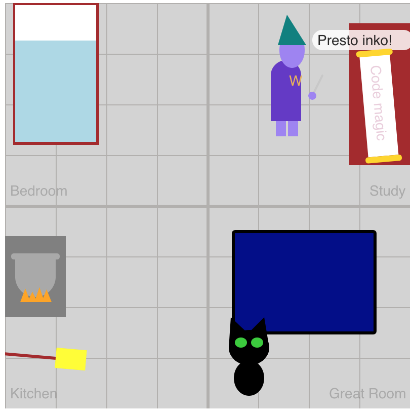

Congratulations, you've done it! You've completed the first steps on your Code Wizard journey.

## Review

In this tutorial, you've worked with many of the fundamental building blocks of programming:

- variables
- objects
- functions
- conditional logic
- if statements
- loops

You are well on your way to becoming a Master Code Wizard.

Best of luck in your future code adventures!

## Other p5.js Resources

These will help as you tackle the extra challenges below or head off into new programming territory to further grow your code magic skills.

- [p5.js Library Reference](https://p5js.org/reference/)
- [Video tutorial playlist by The Coding Train] (https://www.youtube.com/playlist?list=PLRqwX-V7Uu6Zy51Q-x9tMWIv9cueOFTFA)

## Bonus Challenges

You've completed the tutorial, but can you complete all of the bonus challenges below?

# Challenge 1 (Easy)

Make the `pet` change directions **before** it runs in the edge of the canvas so it doesn't look like it's walking into the walls.

# Challenge 2 (Easy)

Further customize the appearance of your castle by modifying more functions in `drawFunctions.js`

# Challenge 3 (Hard)

Add a new `pet` type by adding it to the array in `transformPetSpell()`, creating a new `drawName()` function for it, and modifying the `if` statement in `drawPet()` to call your new function

# Challenge 4 (Hard)

You may have noticed that if you levitate the broom and then leave the kitchen area that the broom stays levitated while you cast other spells.

Modify `updateCurrentSpell()` so that whenever `broom.levitate` is `true` the `.currentSpell` stays assigned to `levitateBroomSpell()`. That way you can drop the `broom` even if you move between rooms.

# Challenge 5 (Hardest)

Come up with your own totally unique customization of the Code Wizard Castle and share it with us!

Send us a link to your custom code and a short description of your changes: [Email Us](make.sc/hoc_custom)

We can't wait to see what you'll create!
